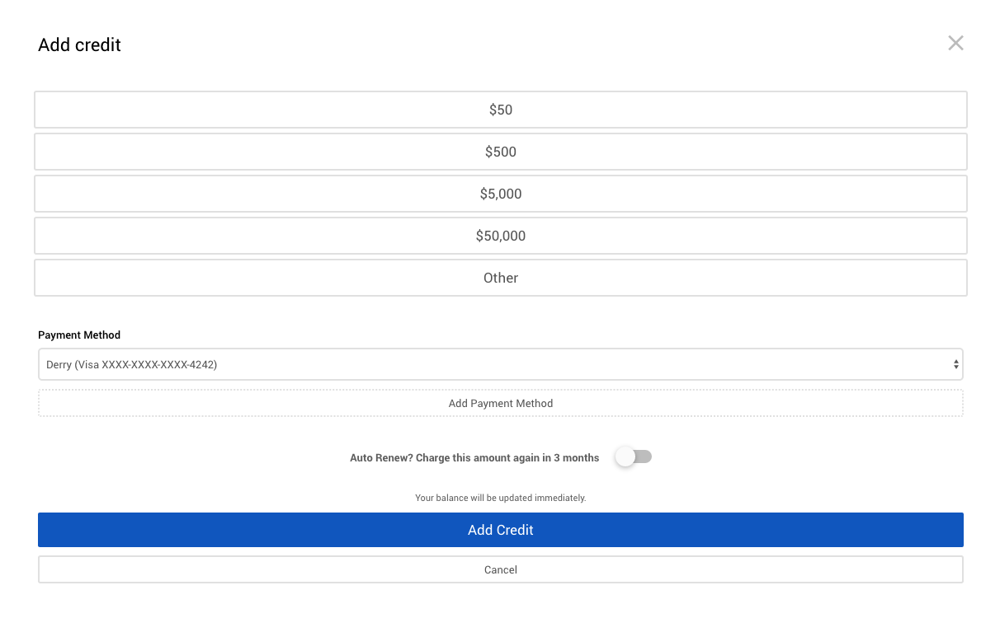

# Billing and Adding Credit

## Charges
The charges page lists all of the compute costs from your job runs. You can use the Search and Advanced search tools in the tool bar to quickly filter charges. You can click view receipts by clicking on the charge amount (in the first column) or the icon in the receipt column.

## Payments
The Payments page lists all of the times you have credited your balance. You can click view receipts by clicking on the payment amount (in the first column) or the icon in the receipt column.

**Add credit to your account** by clicking the large plus icon in the blue circle. You will be presented with the add credit overlay:

There is also a shortcut to this form in the right hand sidebar. For more detail read out [How to add credit](/billing/how-to-add-credit.md) tutorial

## Payment Methods
The Payment Methods page lists all the credit cards we have listed for you, and available to credit your balance. On this pqge you can:

+ Add a new credit card by click on on the plus icon, and filling in the form details.
+ Remove a credit card, by clicking on Remove in the correct row
+ Set a payment method as the default one, the one that will be used when crediting your account by default.

<!-- TODO: DB to edit this file and remove redundand data -->

The easiest and quickest way to increase your account balance is to add credit using the button from the right hand sidebar

### 1. Open the account sidebar and click on Apply Credit
Click on the little profile card (avatar) in the top right of the header and the right sidebar will open.

### 2. Select a credit amount
Click on the Apply Credit button and you will be presented with an overlay. You can press ESC or the X to close this window. Click on one of the set amount options, or click on Other and type in the amount you wish to credit.

### 3. Choose a payment method, or add a new card
You can select which payment method you wish to use (if we have more than one on file for you), or you can click on the Add Payment Method button to add a new credit card right there.

### 4. Worry less with Auto-Renew
In order that you will not forget to keep the balance topped-topped up we have added an Auto-Renew feature that will automatically charge the same card you set here at the end of the expiry period.

### 5. Click Add Credit
Clcking add credit will immediately charge your card and update the account balance.

### Other ways to add credit
You can also make payments to increase your account balance in the Payments tab of the Billings page (simple click the large plus button), or from the User Service Level tab in the Account page.
