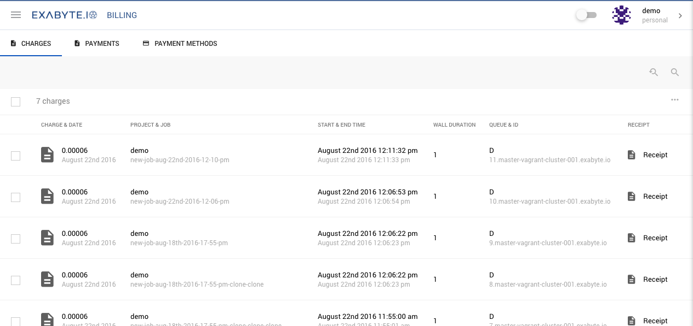
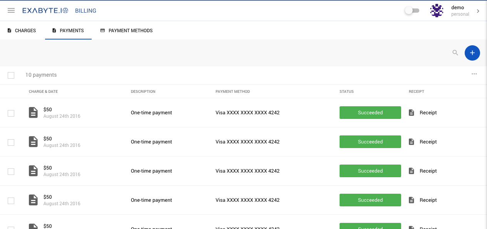

<!-- TODO: by DB -->

# Billings Overview

The billings page has three tabs: Charges, Payments and Payment Methods

## Charges
The charges page lists all of the compute costs from your job runs. You can use the Search and Advanced search tools in the tool bar to quickly filter charges. You can click view receipts by clicking on the charge amount (in the first column) or the icon in the receipt column.

## Payments
The Payments page lists all of the times you have credited your balance. You can click view receipts by clicking on the payment amount (in the first column) or the icon in the receipt column.

## Payment Methods
The Payment Methods page lists all the credit cards we have listed for you, and available to credit your balance. On this page you can:

+ Add a new credit card by click on on the plus icon, and filling in the form details.
+ Remove a credit card, by clicking on Remove in the correct row
+ Set a payment method as the default one, the one that will be used when crediting your account by default.

## Service Level
Charge costs are based on your current service level. The higher your Service Level, the lower the compute costs. Your current Service Level, along with your credit balance and storage quota, can be viewed on in the Service Level page which is in the third tab of the Accounts page.

- Increase your account balance by clicking the Add Credit Button). See [How to increase your balance](/billing/billing-and-payments.md) for more information
- Increase your Storage Quota by clicking the Add Storage button. See [How to increase your Storage Quota](/billing/storage-and-pricing.md) for more information
- Upgrade your Service Level to save money on compute costs by selecting on of the plans and clicking the Upgrade button. For more details see the [How to upgrade your Service Level page](/billing/pricing-and-service-levels.md)

