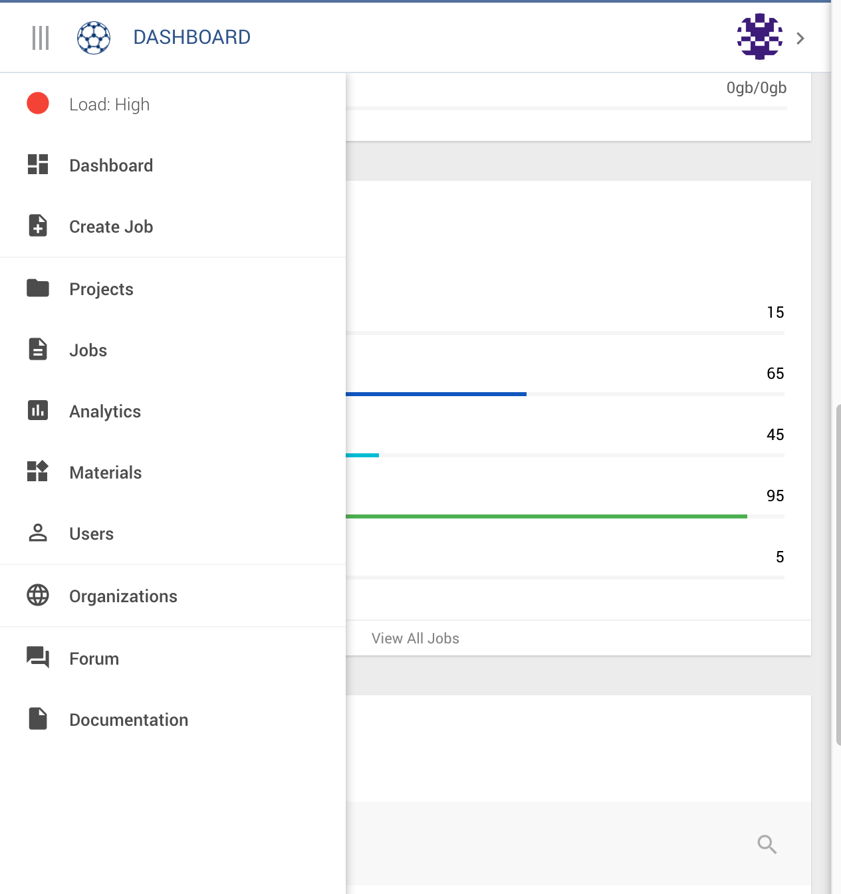
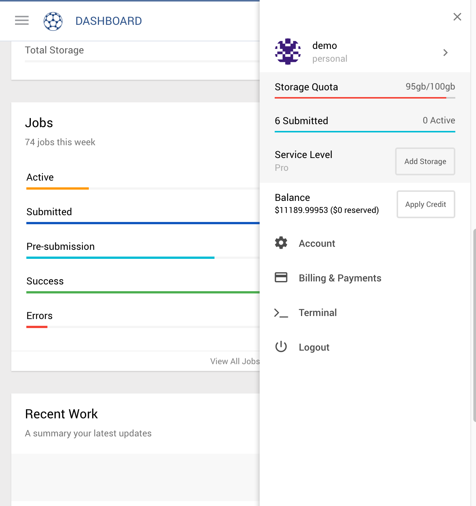

# Project & File Navigation (left)
Clicking on the Left Hand Menu Icon (top left) will open the Project & File Navigator

| Menu Item         | Description
| -------------     |:-------------
| Compute Load      | A simple indicator of the current compute capacity
| Dashboard         | The dashboard shows a summary of recent activity
| Create Job        | You can jump straight into creating jobs here
| Projects          | Shows your list of projects
| Jobs              | Shows your list of jobs
| Analytics         | Allows you to compare multiple materials
| Materials         | Shows your list of materials
| Users             | Shows a list of public users of Exabyte
| Organizations     | Shows a list of public organizations in Exabyte
| Forum             | Discuss issues with other users and Exabyte staff
| Documentation     | A link to this documentation is always here

## Compute Load
The compute load shows in a simple indicator of how busy the compute nodes are. There are three levels: low, medium and high. It is opportune to start jobs when the indicator is low in order to achieve a quicker turnaround. Conversely, if the compute load is high, wait times for job turnaround will be longer.

## Dashboard
The dashboard highlights important datapoints and files of recent activity. More about this can be found on the [Dashboard Page](dashboard.md)

## Create Job
This is a quick link to get you started straight away on a job. Jobs saved will be collected in your default user project, which is name the same as your username and can be found in the [Projects page](projects.md).

## Projects
A link to [your list of projects](projects.md).

## Jobs
A link to [your list of jobs](jobs.md).

## Analytics
A link to the [analytics page](analyics.md) where you can compare characteritics of materials you have in your materials list.

## Materials
A link to [your list of materials](materials.md).

## Users
A [list of users](users.md) you are allowed to view (eg. your teammates). (and a list of pubic users on the Exabyte platform, right?)

## Organizations
A [list of your organizations](organizations.md). (and a list of pubic organizations on the Exabyte platform, right?)

## Forum
A link to the [Exabyte forum](forum.md) where you can open and discuss topics with other users of the syste, your colleagues or Exabyte staff.

## Documentation
You will always find a link to this documentation here, at the bottom of the left hand sidebar.

# Account, Profile and Billing Menu (Rightside)
Clicking on the Left Hand Menu Icon (top left) will open the Project & File Navigator

| Menu Item                     | Description
| -------------                 |:-------------
| Account Switcher              | A simple indicator of the current compute capacity
| Quota, Queue & Service Level  | The dashboard shows a summary of recent activity
| Account Balance               | You can jump straight into creating jobs here
| Account                       | Pages related to your profile, preferences and service level
| Billings & Payments           | Pages related to your charges, payments and payment methods
| Terminal                      | Open a terminal CLI connection to your files
| Logout                        | Logout of the platform

## Account Switcher
You can easiliy switch between your personal account and your organizational accounts by clicking here. This will open a small window showing your other active accounts. Click on one to switch to that account.

## Quota, Queue & Service Level summary
This section shows a quick snapshot of the status of your quota: Storage, job queue breakdown and your service level. You can easily upgrade your service level, to obtain more compute power, simply by clicking the upgrade button. If you want to compare service levels, you will find more information in the Account menu, below.

## Account Balance
A quick snapshot of your current account balance. If you have many jobs in the queue, and a low balance, you can easily add credit by clicking the Apply Credit button to quickly and immediately increase your balance.

## Account
A link to [your account](account.md) page. In here you will find your user profile, your preferences and service level.

## Billings and payments
A link to the [billings and payments](billings.md) section. In here you will your compute charges, payment records and payment methods.

## Terminal
Access to an in-browser CLI terminal thorugh which you can directly access your cloud account.

## Logout
Securely logout of the service.
