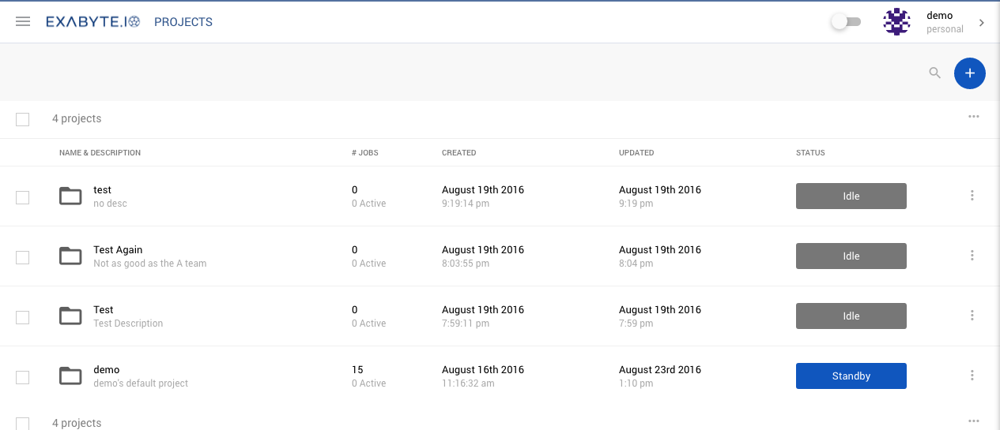
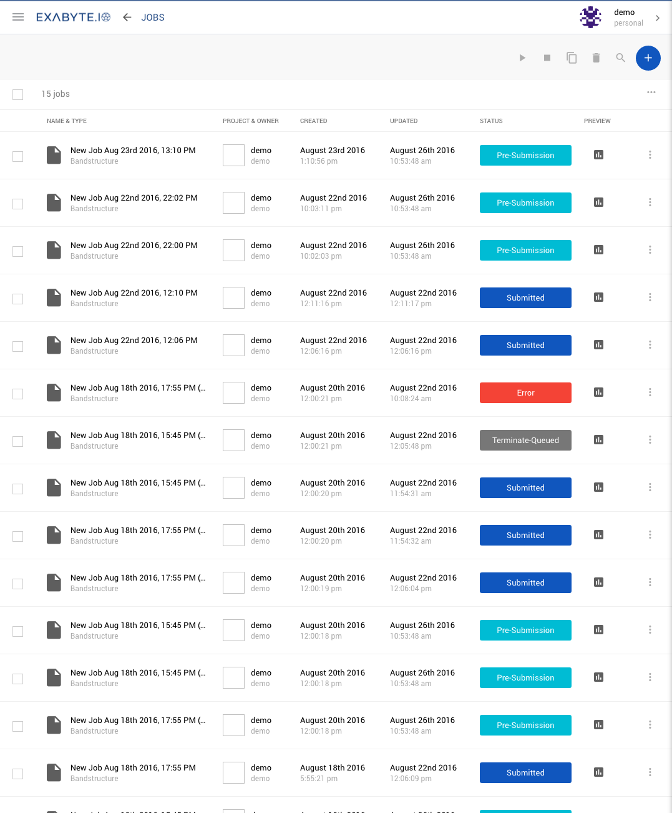
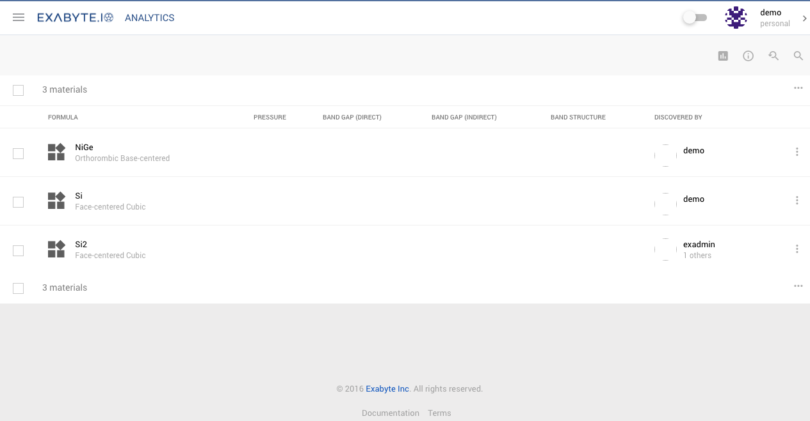
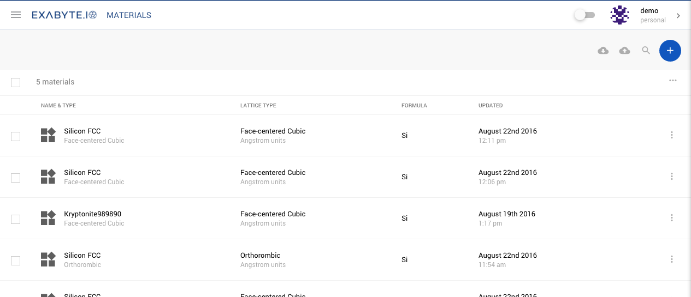
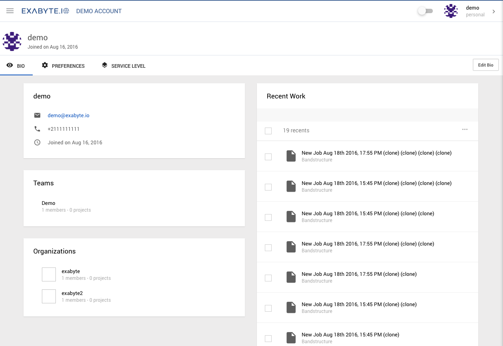

<!-- TODO by DB -->

# Project Navigation (left-side)
Clicking on the Left Hand Menu Icon (top left) will open the Project & File Navigator

| Menu Item                                     | Description
| -------------                                 |:-------------
| Compute Load                                  | The compute load shows in a simple indicator of how busy the compute nodes are. There are three levels: low, medium and high. It is opportune to start jobs when the indicator is low in order to achieve a quicker turnaround. Conversely, if the compute load is high, wait times for job turnaround will be longer.
| [Dashboard](ui-overview.md#dashboard)         | The dashboard highlights important datapoints and files of recent activity
| [Create Job](first-simulation.md)             | This is a quick link to get you started straight away on a job. Jobs saved will be collected in your default user project, which is name the same as your username and can be found in the projects page].
| [Projects](ui-overview.md#projects)           | Shows your list of projects
| [Jobs](ui-overview.md#jobs)                   | Shows your list of jobs
| [Analytics](ui-overview.md#analytics)         | Allows you to compare multiple materials
| [Materials](ui-overview.md#materials)         | Shows your list of materials
| Users                                         | Shows a list of public users of Exabyte
| Organizations                                 | Shows a list of public organizations in Exabyte
| Forum                                         | Discuss issues with other users and Exabyte staff
| Documentation                                 | A link to this documentation is always here

# Account Navigation (right-side)
Clicking on the Left Hand Menu Icon (top left) will open the Project & File Navigator

| Menu Item                         | Description
| -------------                     |:-------------
| Account Switcher                  | You can easiliy switch between your personal account and your organizational accounts by clicking here. This will open a small window showing your other active accounts. Click on one to switch to that account.
| Quota, Queue & Service Level      | This section shows a quick snapshot of the status of your quota: Storage, job queue breakdown and your service level. You can easily upgrade your service level, to obtain more compute power, simply by clicking the upgrade button. If you want to compare service levels, you will find more information in the Account menu, below.
| Account Balance                   | A snapshot of your current balance, quickly credit the balance using the Apply Credit Button
| [Account](../billing/settings-and-profile.md)                           | A link to [your account](../billing/settings-and-profile) page. In here you will find your user profile, your preferences and service level.
| [Billings & Payments](../billing/billing-and-adding-credit.md)               | A link to the [billings and payments](../billing/billing-and-adding-credit.md) section. In here you will your compute charges, payment records and payment methods.
| Terminal                          | Access to an in-browser CLI terminal thorugh which you can directly access your cloud account.
| Logout                            | Securely logout of the service.

## User Dashboard
The dashboard is the first page you will see when you log in to Exabyte.

### Compute Usage
The compute usage chart shows the compute costs of your job runs from the last week (7 days).

### Datapoints
Underneath the compute chart we offer a selection of key datapoints for your convenience.

| Datapoint             | Description
| -------------         |:-------------
| Charges this week     | Shows a summary of the total charges of this week
| Charges last week     | Shows the equivalent charges of last week for comparison
| Longest Job           | Shows longes compute time of the week
| Current Server Load   | Shows current server compute load (low/medium/high)
| Estimated Wait Time   | Shows an estimated wait time for compute power

### Storage Quota
This widget displays a summary of your current data storage quota: used and total storage space. Click on the plus icon to quickly increase your storage quota. Click on the arrows icon to refresh the quota data.

### Jobs summary
The Jobs summary widget summarises the total number of jobs run during this same period, and also offers a break down of the job types. There is a quick link to jump to the jobs list.

## Projects
The Projects page lists all the projects you have created. Projects contain collections of Jobs, cLick on a project to go into more details of this project. Click on the plus icon to create a new one.

## Jobs
The Jobs page is a complete list of all the jobs you have run, regardless of project. Principle actions here are:

- Click on a job name to quickly open it.
- You can preview job results by clicking the icon in the preview column.
- Clicking on the three vertical dots icon will open a submenu from where you can Run, Terminate, Clone, Delete or Open the job.
- Click on the Plus icon (top right) to create a new job
- Use the checkboxes to select multiple jobs, and the toolbar icons (top right) to run actions on all the jobs selected. eg. For running multiple jobs at once.

## Analytics
The analytics page allows you to select Multiple materials and compare the results of the simulations. The first step is to select which materials you would like to compare by ticking the boxes on the left. See the Tutorial on [How to compare materials](/materials/how-to-compare-materials.md)

## Materials
A list of all the materials you have imported, created or uploaded into your account. Principle actions on this screen:

- Use the cloud icon with the down arrow to import materials into your account from cloud services
- Use the cloud icon with up arrow inside to upload materials from your desktop to your account
- Use the large Plus icon button to create a new material
- Use the search icon for a simple search mechanism to filter the materials list once it become large.

## Account & Preferences
The Account page has three tabs:

+ Bio shows your public profile information and recent work
+ Preferences holds your account preferences such as Tour, Cloning suffixes and other tools
+ Service Level shows details about your current balance, storage quota and Service Level. See the [Accounts & Billings](/getting-started/billing-overview.md) section for more details.

