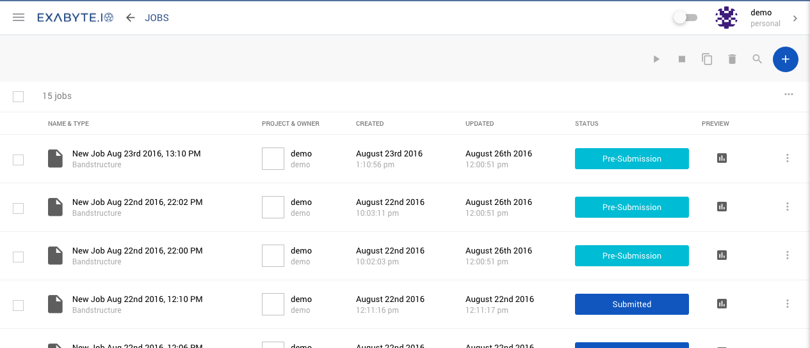

<!-- DB -->

This page summarizes the main components of Exabyte.io user interface: header, sidebars left and right, user accounts switch, dashboard, main content area, materials editor and other pages.

!!! Warning "Outdated visuals"
    Some visuals below may be outdated and demonstrate a similar, however not exactly accurate user experience compared to what our product currently provides.

## Items and Functions Navigation (left sidebar)

Clicking on the Left Hand Menu Icon <i class="zmdi zmdi-menu zmdi-hc-border"></i> will open the Items and Functions Navigator

| Menu Item & Icon                                         | Description
| :---------------------------                      |:-------------
| <i class="zmdi zmdi-circle"></i> &nbsp; Load                                      | Compute load shows how busy the compute system is. There are three levels: low, medium and high. It is opportune to start jobs when the indicator is low in order to achieve a quicker turnaround. Conversely, if the compute load is high, wait times for job turnaround will be longer.
| <i class="zmdi zmdi-view-dashboard"></i> &nbsp; [Dashboard](ui-overview.md#dashboard)         | Dashboard highlights important datapoints and files of recent activity
| <i class="zmdi zmdi-file"></i> &nbsp; [Create Job](/getting-started/run-first-simulation.md)             | This is a quick link to get you started straight away on a job. Jobs saved will be collected in your default user project, which is name the same as your username and can be found in the projects page].
| <i class="zmdi zmdi-folder"></i> &nbsp; [Projects](ui-overview.md#projects)           | Shows your list of projects
| <i class="zmdi zmdi-file"></i> &nbsp; [Jobs](ui-overview.md#jobs)                   | Shows your list of jobs
| <i class="zmdi zmdi-chart"></i> &nbsp; [Analytics](ui-overview.md#analytics)         | Allows you to compare multiple materials
| <i class="zmdi zmdi-widgets"></i> &nbsp; [Materials](ui-overview.md#materials)         | Shows your list of materials
| <i class="zmdi zmdi-account"></i> &nbsp; Users                                         | Shows a list of public users of Exabyte
| <i class="zmdi zmdi-cloud-box"></i> &nbsp; Dropbox                                         | File browser for cloud-based file/directories
| <i class="zmdi zmdi-globe-alt"></i> &nbsp; Organizations                                 | Team collaboration and extended privacy
| <i class="zmdi zmdi-comments"></i> &nbsp; Forum                                         | Discuss issues with other users and Exabyte.io staff
| <i class="zmdi zmdi-file"></i> &nbsp; Documentation                                 | A link to this documentation

## Account Navigation (right sidebar)

Clicking on your name/username in the top right will open the Account navigation.

| Menu Item & Icon                                                            | Description
|:-----------------------------------------------------------------------   |:-------------
| Account Switcher                                                        | Enables switching between personal and organizational accounts. Opens in a small window showing your active accounts. Clicking on one triggers switch to that account.
| Quota, Queue, Service Level                                             | This section shows a quick snapshot of the status of your quota: Storage, job queue breakdown and your service level. You can easily upgrade your service level, to obtain more compute power, simply by clicking the upgrade button. If you want to compare service levels, you will find more information in the Account menu, below.
| Account Balance                                                         | A snapshot of your current balance, quickly credit the balance using the Apply Credit Button
| <i class="zmdi zmdi-settings"></i> &nbsp; [Account](../billing/settings-and-profile.md)                           | A link to [your account](../billing/settings-and-profile) page. In here you will find your user profile, your preferences and service level.
| <i class="zmdi zmdi-card"></i> &nbsp; [Billing & Payments](../billing/billing-and-payments.md)               | A link to the [billings and payments](../billing/billing-and-payments.md) section. In here you will your compute charges, payment records and payment methods.
| <i class="fa fa-terminal"></i> &nbsp; Terminal                                                                | Access to an in-browser command-line terminal thorugh which you can directly access your cloud account.
| <i class="fa fa-desktop"></i> &nbsp; Remote Desktop                                                          | Opens a desktop session (VNC) on Exabyte.io remote server.
| <i class="zmdi zmdi-accounts-add"></i> &nbsp; Invite a friend                                                         | Earn credits by inviting people to join Exabyte.io
| <i class="zmdi zmdi-power"></i> &nbsp; Logout                                                                  | Secure logout

## User Dashboard

Dashboard is the first page you will see when you log in. Its purpose is to quickly fill you on on the status of the system and your recent work.

### Compute Usage

Compute usage chart shows the compute costs of your job runs from the last week (7 days).

### Datapoints

Underneath the compute chart we offer a selection of key datapoints for your convenience.

| Datapoint             | Description
| :-------------        |:-------------
| Charges this week     | Shows a summary of the total charges of this week
| Charges last week     | Shows the equivalent charges of last week for comparison
| Longest Job           | Shows compute walltime of the longest job
| Current Server Load   | Shows current server compute load (low/medium/high)
| Estimated Wait Time   | Shows an estimated wait time for compute power

### Storage Quota

This widget displays a summary of your current data storage quota: used and total storage space. Click on the <i class="zmdi zmdi-plus-circle-o zmdi-hc-border"></i> icon to quickly increase your total storage quota. Click on the <i class="zmdi zmdi-refresh-sync zmdi-hc-border"></i> icon to refresh the quota data.

### Jobs summary

Jobs summary widget summarizes the total number of jobs run during this same period, and also offers a break down of the job types. There is also a quick link to jump to the jobs list.

## Create Job

Create Job shortcut link <i class="zmdi zmdi-file-plus zmdi-hc-border"></i> takes you to the simulation wizard where you can quickly create and run a simulation. By default the job is saved in your [default project](/getting-started/data-conventions.md). First tab is the Material Designer tab. Material design editor has a black background, surrounding functions of Material Design - such as naming, workflow and compute - have white backgrounds. More information on [running a simulation can be found here](/getting-started/run-first-simulation.md).

## Projects

Projects page lists all the projects you have created. Projects contain collections of Jobs, click on a project to navigate into it. Click on the <i class="zmdi zmdi-plus-circle"></i> icon to create a new one.

## Jobs

Jobs page is a complete list of *all* the jobs you have run, regardless of project. Principle actions here are:

- Click on a job name to quickly open it,
- Preview job results by clicking the icon in the preview column,
- Clicking on the three vertical dots icon <i class="zmdi zmdi-more-vert zmdi-hc-border"></i> will open a submenu from where you can Run <i class="zmdi zmdi-play zmdi-hc-border"></i>, Terminate <i class="zmdi zmdi-stop zmdi-hc-border"></i>, Clone <i class="zmdi zmdi-copy zmdi-hc-border"></i>, Delete <i class="zmdi zmdi-delete zmdi-hc-border"></i> or Open <i class="zmdi zmdi-chevron-right zmdi-hc-border"></i> the job,
- Click on the Plus icon <i class="zmdi zmdi-plus-circle zmdi-hc-border"></i> to create a new job,
- Use the checkboxes to select multiple jobs, and the toolbar icons (top right) to run actions on all the jobs selected. eg. For running multiple jobs at once.

## Users

Users page shows all the user profiles that are accessible to you.

## Organizations

Coming soon are Organizations, where collaboration happens between teams. The Organizations page will show all the organization profiles that are accessible to you.

## Analytics

Analytics page allows you to select multiple materials and compare the results of the simulations. First step is to select which materials you would like to compare by ticking the boxes on the left.

## Dropbox

Dropbox is a limited-capacity cloud-based data storage (see [data conventions](/getting-started/data-conventions/#dropbox-directory)) accessible under the same filesystem path everywhere within our application. This menu item opens a file browser where one can navigate and edit (upload, download, delete) files and directories. Convenient for auxiliary simulations data (eg. pseudopotentials).

## Materials

A list of all the materials you have imported, created or uploaded into your account. Principle actions on this screen:

- Use the cloud icon with the down arrow <i class="zmdi zmdi-cloud-download zmdi-hc-border"></i> to import materials into your account from cloud services
- Use the cloud icon with the up arrow <i class="zmdi zmdi-cloud-upload zmdi-hc-border"></i> to upload materials from your computer to your account
- Use the large Plus icon button <i class="zmdi zmdi-plus-circle zmdi-hc-border"></i> to create a new material
- Use the search icon <i class="zmdi zmdi-search zmdi-hc-border"></i> for a simple search mechanism to filter the materials list once it become large.

## Account Switcher

Coming soon are Organizations, where collaboration happens between teams. The Profile card at the top of the right hand menu shows the account you are currently using. Normally this would be your personal profile, but if you have created, or are a member of, an organization, clicking here will open the list of organizations to which you belong. You can then click on one to begin using Exabyte.io as that organization member instead of your personal account. Interface will now show data related to the organization profile: eg. storage quota and balance will be that of the organization. Projects and jobs will be those submitted by the organization. You can switch back to your personal profile by using the account switcher again and selecting your personal account.

## Account Snapshot

Below the account switcher is a snapshot of your account (or that of an organization, as explained above). We show some basic information related to your account: Storage Quota, job queue summary, service level and current balance.

## Account and Preferences

Account page has three tabs:

+ Bio <i class="zmdi zmdi-eye zmdi-hc-border"></i> shows your public profile information and recent work
+ Preferences <i class="zmdi zmdi-settings zmdi-hc-border"></i> holds your account preferences such as Tour, Cloning suffixes and other tools
+ Service Level <i class="zmdi zmdi-layers zmdi-hc-border"></i> shows details about your current balance, storage quota and Service Level. See the [Accounts & Billings](/billing/settings-and-profile.md) section for more details.

## Billing

Billings link takes you to the Billing page which shows your account Charges <i class="zmdi zmdi-file-text zmdi-hc-border"></i>, Payments <i class="zmdi zmdi-file-plus zmdi-hc-border"></i> and Payment Methods <i class="zmdi zmdi-card zmdi-hc-border"></i>. [Click here to find more details](/billing/billing-and-payments.md).

## Terminal and Remote Desktop

Alternative access to your Exabyte.io account. More information [here](../cli/login.md).

## Invite a friend

You both will get $10 credit when registration request is approved. Find out how in the [Refer a friend page](/collaboration/invite-friends.md)
