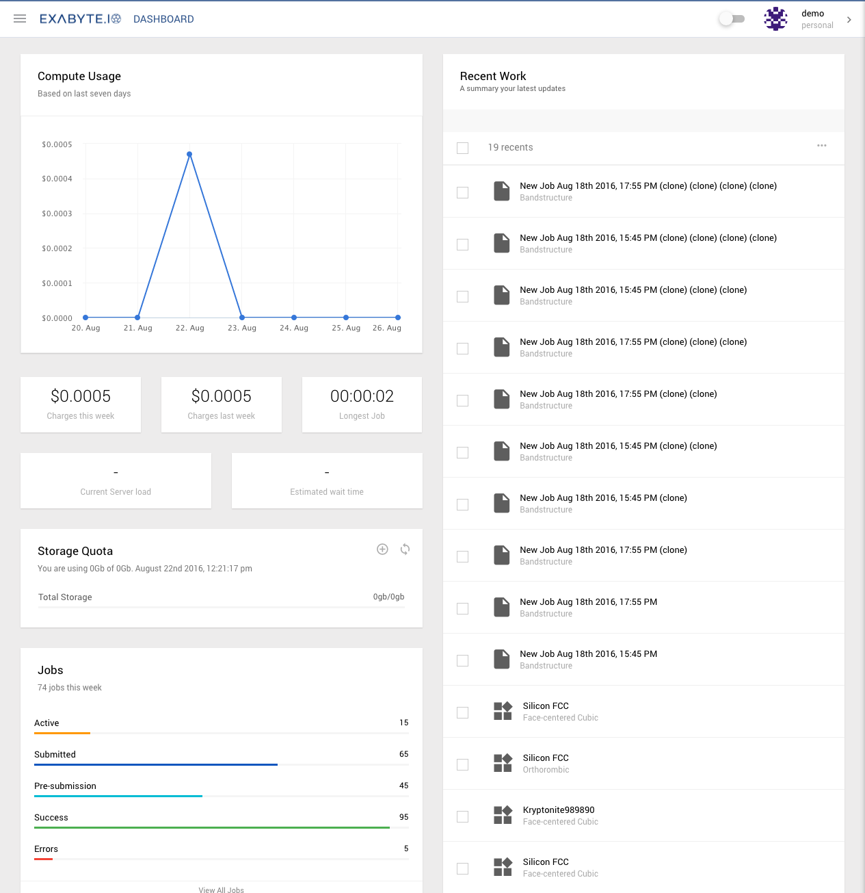

## User Dashboard
The dashboard is the first page you will see when you log in to Exabyte.

## Compute Usage
The compute usage chart shows the compute costs of your job runs from the last week (7 days).

## Datapoints
Underneath the compute chart we offer a selection of key datapoints for your convenience.

| Datapoint             | Description
| -------------         |:-------------
| Charges this week     | Shows a summary of the total charges of this week
| Charges last week     | Shows the equivalent charges of last week for comparison
| Longest Job           | Shows longes compute time of the week
| Current Server Load   | Shows current server compute load (low/medium/high)
| Estimated Wait Time   | Shows an estimated wait time for compute power

## Storage Quota
This widget displays a summary of your current data storage quota: used and total storage space.

- Click on the plus icon to increase your storage quota
- Click on the arrows icon to refresh the quota data

## Jobs summary
The Jobs summary widget summarises the total number of jobs run during this same period, and also offers a break down of the job types. There is a quick link to jump to the jobs list.
