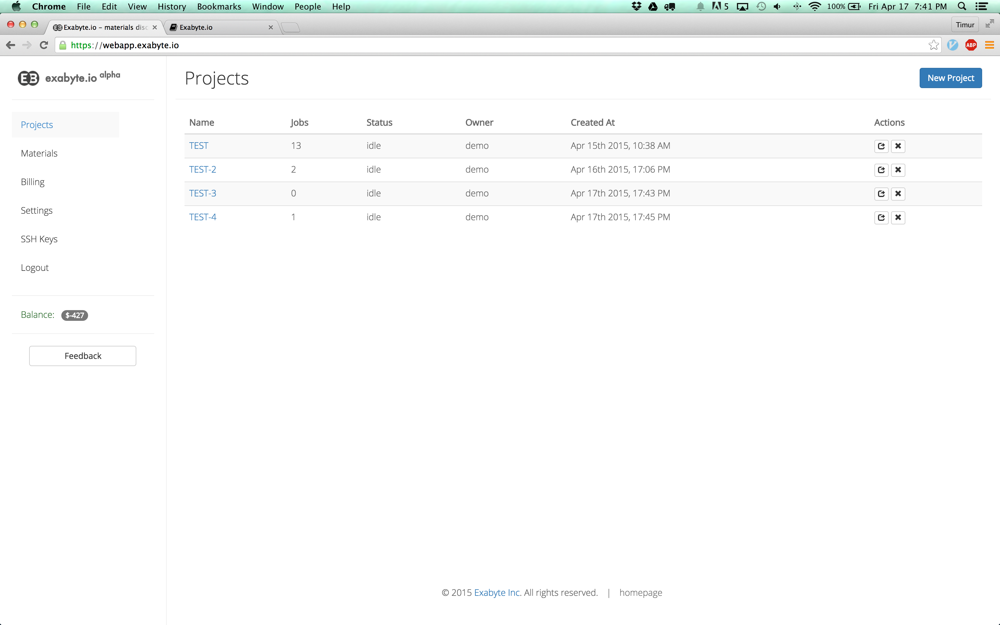
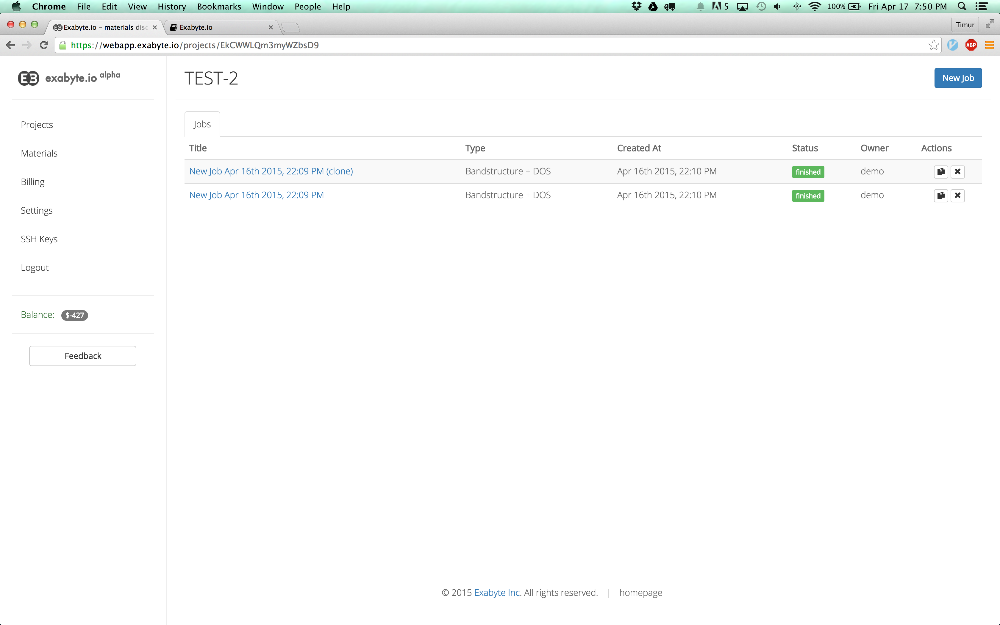

# Welcome!

Welcome to our documentation repository. We aim to provide all necessary information for you to be able to use our platform here. In case you find that something is missing of you are still puzzled after reading this documentation, please <a href="mailto:support@exabyte.io" target="_blank">contact us</a> .

## QuickStart

If you are new to Exabyte you can get started by following this tutorial summarizing the
[first steps with Exabyte](tutorials/first-steps.md). You will learn how to create and save your first material and run a simulation that predicts this material's electronic bandstructure.

## Projects

We organize user workspace using projects. Project shall contain a study of a particular material or a set of materials that are related to each other. Projects are owned by an administrator and can have multiple users that collaborate together (coming soon).

#### Project Properties

- Name: name of a project
- Jobs: number of [jobs](#jobs) that belong to this project
- Status: "idle" if no jobs are running, "active" otherwise
- Owner: creator of a project (by default)
- Created At: date and time of project creation

When you login to our application, the first thing you see is list of projects.

 

 

You can create a new project by clicking "New Project" button at the top right corner of the page.

To see the jobs that belong to a project, click on project's name.

## Jobs

Job is a computation abstraction. Job contains set of [units](#units).
Units formulate a workflow. You can imagine workflow as an array of units.
Order matters - each unit will run computation one by one starting from the first
unit of the workflow.

#### Job Properties

- Title
- Type: a brief description of a workflow that this job is using
- Created At: date and time of project creation
- Status: one of the statuses explained below
- Owner: creator of a project (by default)
- Actions: available actions applicable to this job - example: clone, delete

#### Job Statuses

- pre-submission: job is created on the front-end only
- submitted: submitted to resource manager on compute cluster
- active: execution is in process
- finished: execution finished
- terminated: execution or submission terminated by user
- error: execution resulted in error

When you click on one of the Projects you see the list of jobs.

 

 

You can create a new Job by clicking "New Job" button at the top right corner of the page.

To view the job, click on its name.

## Materials

"Materials" section contains all previously created materials. It is empty initially, however you can start saving your materials during the simulations (jobs), and you can use previously saved materials in your new jobs.

Add more materials by clicking "New Material" button at the top right corner of the page.

## SSH Keys

SSH Keys section contains the your public keys that give you command-line access to our compute platform through secure shell protocol. You can generate ssh keys on your local machine and upload the public one to our compute platform.

More documentation about our compute platform is available [here](cluster/index.md).

A good tutorial on how to create SSH keys can be found [here](https://www.digitalocean.com/community/tutorials/how-to-set-up-ssh-keys--2).

## Billing

Billing page contains accounting information about your jobs:

- Project: project the job belongs to
- Job: the name of the job
- Processors: number of the processors the job used at runtime
- Invoice Date: Billing record for the job
- Sum($): cost per job in $
- Wall duration: total amount of compute time used by the job (in CPU-hours)

## Settings

Settings section lets one update personal information, system-specific parameters and security settings.

