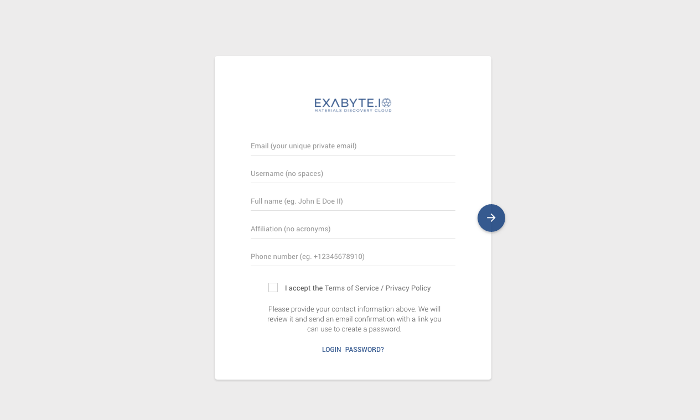

## Filling in the form
Currently we manually approve applications to join Exabyte, and in order to do so we require certain details from applicants, all the fields are required. See descriptions of each field in the table shown underneath the below screenshot.

> All newly registered users have $10 credited to their personal allocations. If you are not a member of a project that already has an allocation, you may purchase an allocation using our web application.

| Field         | Description                                       ||
| ------------- |:-------------                                     | -----:
| Email         | A valid email                                     | required
| Username      | Alphanumeric & lowercase from 5 to 10 symbols     | required
| Affiliation   | Organisational affiliation                        | required
| Phone Number  | With country code (+001 for example)              | required
| Privacy       | Please read and accept                            | required

## Invitations and credit

We hope to encourage a sharing environment, and in order to facilitate this we offer users incentives via invitation links and crediting accounts. You can, as a user, invite other members and both will receive balance credits. When you receive an invitation from another user, follow the link in the email to the registration page so that we can track your information and credit both your, and your friend's, account.

## How quickly are registrations approved

We try to respond with 24 hours to each request, we may need to request further information before activating the account.

## How your data is used to approve a registration

We vet all applications based on the information you provide, and what is available publicly. We will decide the application based on this combined information. We may need to request more information and will respond as quickly as possible in order to process the activation quickly.

## Already have an account?

If you already have an account, use the link at the foot of the document to jump to the login form. If you have an account but have forgotton your password, use the "Password" link.
