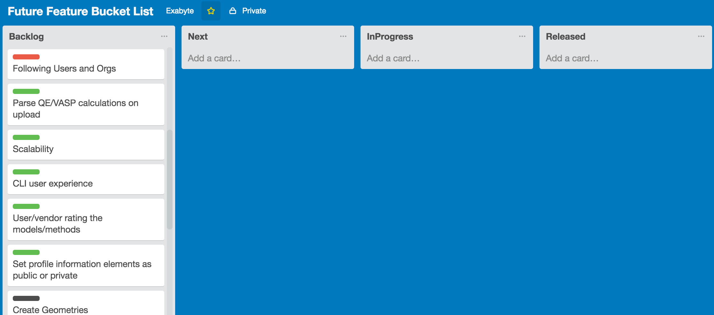

We have setup a public [feature roadmap on Trello](https://trello.com/b/89eLrRW0/future-feature-bucket-list).

This is a work-in-progress roadmap of all the things we are currently adding (and plan to add) to the Exabyte platform. As we start planning what to work on, features move from left to right until they’re completed and ready for everyone!

#### Voting for Features
If you have an idea that you want to see on our roadmap head over to our Trello board and add a card in the backlog.

#### Columns
+ Backlog = big unsorted "ToDo" bucket
+ Next = things we’re going to work on next
+ In progress = things we’re working on right now
+ Recently released = things we have already released

#### Labels
Label colours indicate the area of cards in our roadmap.

+ Discovery: Social, Sharing & Project Collaboration (blue)
+ Material Design (black)
+ Models & Methods (purple)
+ Cloud & Supercomputing (cyan)
+ Command Line Interface (grey)
+ Artifical Intelligence & Analytics (green)
