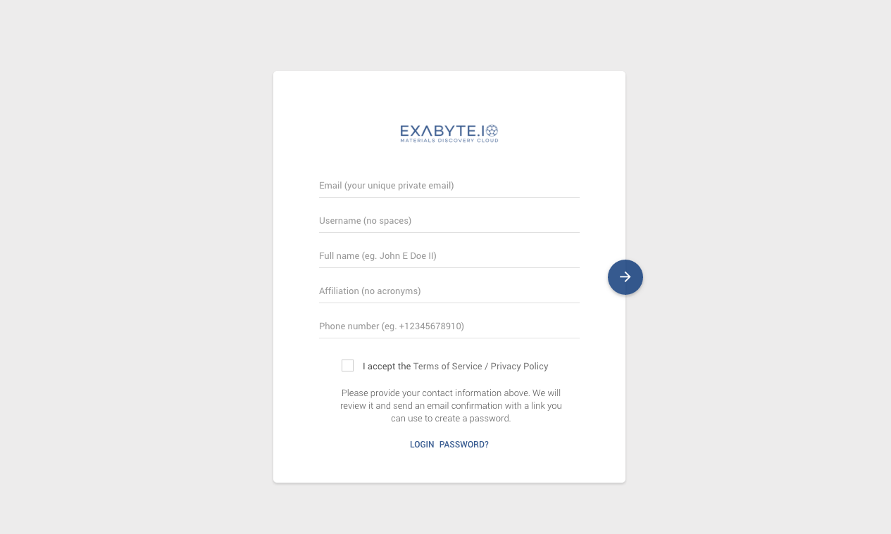

[TOC]

## Filling in the form
Currently we manually approve applications to join Exabyte, and in order to do so we require certain details from applicants, all the fields *except affiliation* are required. See descriptions of each field in the table shown underneath the below screenshot.

> All newly registered users have $10 credited to their personal allocations. If you are not a member of a project that already has an allocation, you may purchase an allocation using our web application.

| Field         | Description               ||
| ------------- |:-------------             | -----:
| Email         | a valid email             | required
| Username      | 8-24 letters, no spaces   | required
| Affiliation   | university affiliation    ||
| Phone Number  | With country code         | required
| Privacy       | Please read and accept    | required

## Invitations and Credit

Lorem ipsum dolor sit amet, consectetur adipisicing elit, sed do eiusmod tempor incididunt ut labore et dolore magna aliqua. Ut enim ad minim veniam, quis nostrud exercitation ullamco laboris nisi ut aliquip ex ea commodo consequat. Duis aute irure dolor in reprehenderit in voluptate velit esse cillum dolore eu fugiat nulla pariatur. Excepteur sint occaecat cupidatat non proident, sunt in culpa qui officia deserunt mollit anim id est laborum.

## How Quickly are Registrations Approved

Lorem ipsum dolor sit amet, consectetur adipisicing elit, sed do eiusmod tempor incididunt ut labore et dolore magna aliqua. Ut enim ad minim veniam, quis nostrud exercitation ullamco laboris nisi ut aliquip ex ea commodo consequat. Duis aute irure dolor in reprehenderit in voluptate velit esse cillum dolore eu fugiat nulla pariatur. Excepteur sint occaecat cupidatat non proident, sunt in culpa qui officia deserunt mollit anim id est laborum.

## How your data is used to approve a registration

Lorem ipsum dolor sit amet, consectetur adipisicing elit, sed do eiusmod tempor incididunt ut labore et dolore magna aliqua. Ut enim ad minim veniam, quis nostrud exercitation ullamco laboris nisi ut aliquip ex ea commodo consequat. Duis aute irure dolor in reprehenderit in voluptate velit esse cillum dolore eu fugiat nulla pariatur. Excepteur sint occaecat cupidatat non proident, sunt in culpa qui officia deserunt mollit anim id est laborum.

## Already have an account?

If you already have an account, use the link at the foot of the document to jump to the login form. If you have an account but have forgotton your password, use the "Password" link.
