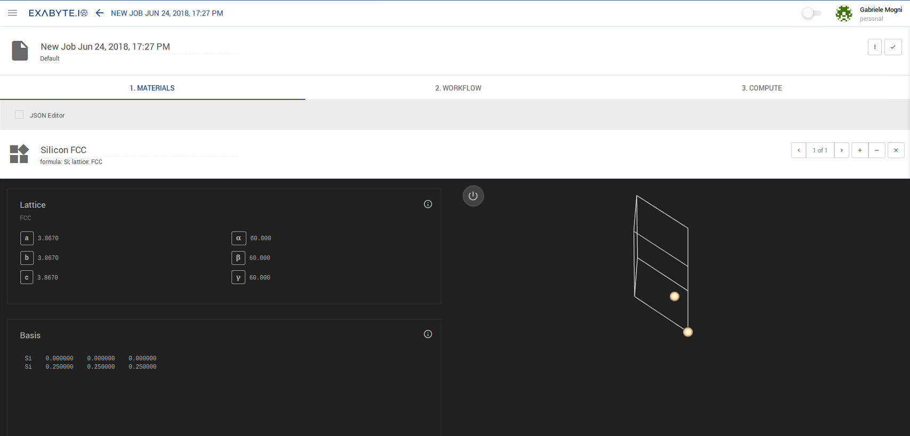
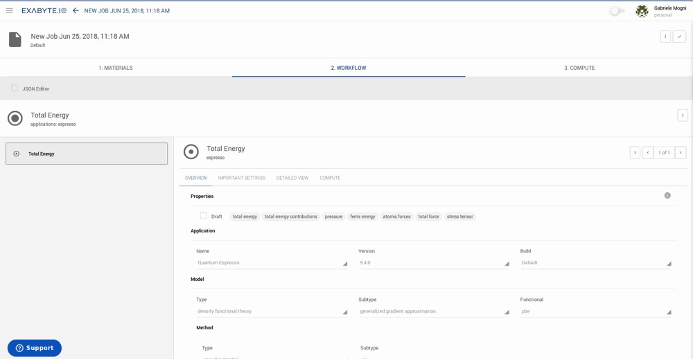
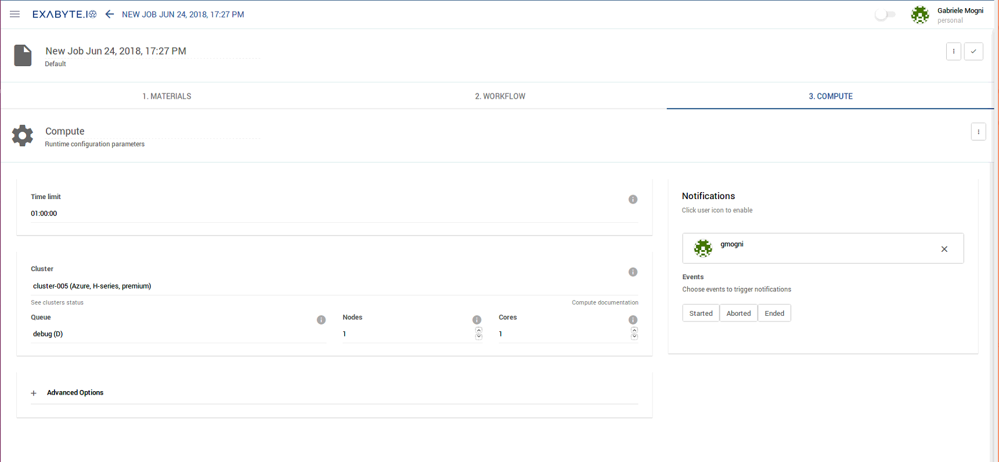
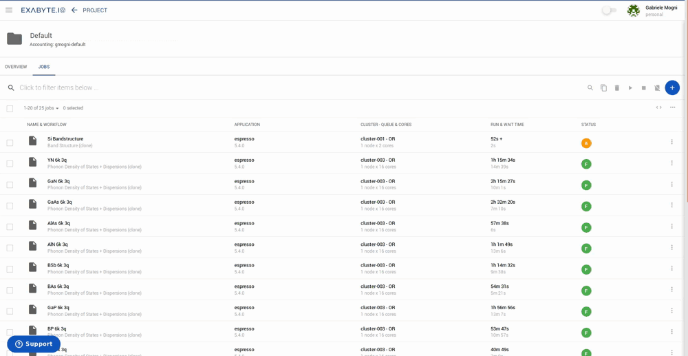
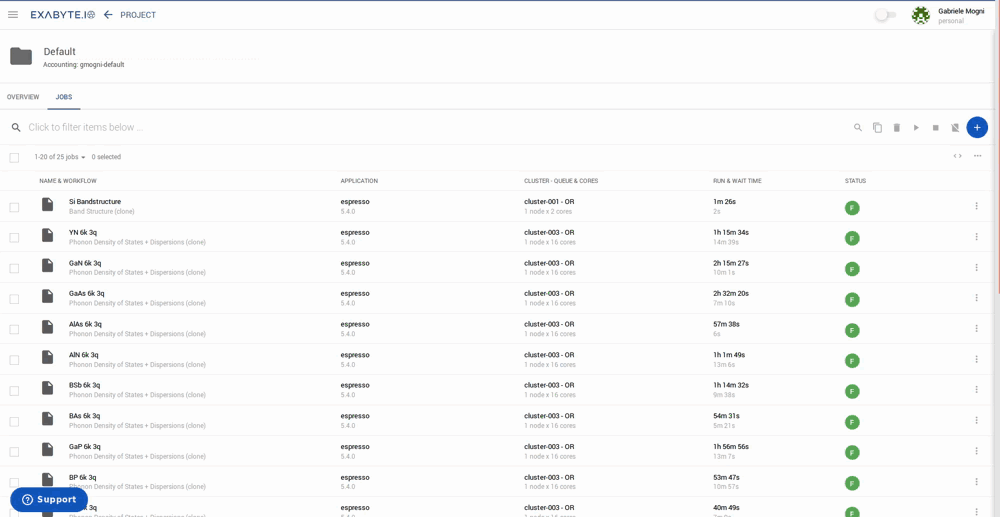

<!-- by MH -->

This page explains how to run a simple density functional theory calculation to obtain an electronic bandstructure. We will study silicon in the standard face-centered cubic structure and use Quantum ESPRESSO as the simulation engine.

# Open Job Designer

Start by click "Create Job" link in the left-hand sidebar.

You will be taken to the "Job Desinger" page where you can:

- Choose a material (one that you created and saved before)
- Choose and adjust a simulation Workflow
- Setup compute parameters

For the sake of this tutorial, we will keep the default parameters at each step. To modify the default material, click on the "Materials" option in the left-hand sidebar, which will take you to your own personal repository of previously-designed or imported crystal structures. Select the desired structure by ticking its corresponding check-box located at the beginning of the repository entry, and then click on the three vertical dots located at the very end of the entry line. Finally select the "Set default" option marked with a star at the bottom of the resulting menu. The default workflow can also be modified in a similar fashion: select "Workflows" from the left-hand sidebar, and then repeat the same procedure as for selecting the default material described previously. You can check which material or workflow has been selected as default anytime by navigating to the correpsonding repository and inspecting which entry has a checkmark assigned to it under the "Default" column. 

To import new material structures into your own personal collection, first navigate to the "Materials" option in the left-hand sidebar. You are now confronted with the following options in the taskbar on the top-right-hand side of the page: either import structures from a central repository of predefined material structures (obtained directly from the materialsproject.org database), directly upload structure files in the POSCAR or CIF formats, or manually create new structures (blue plus icon located at the end of the taskbar) with the aid of the incorporated Exabyte Materials Designer tool. To import new workflows into your personal collection on the other hand, select the "Bank" option in the left-hand sidebar and then "Workflows". The user will be presented with a comprehensive list of centrally-stored and pre-defined workflows. A similar list of pre-defined materials can also be accessed through the alternative "Materials" sub-selection under "Bank", which complements the afore-mentioned collection from the materialsproject.org database. To import both workflows and material structures from the Bank to your own personal collection, simply select the desired entry by ticking the checkbox at the start of the entry line and then click on "Copy" in the top-right taskbar of the page. The procedure to import crystal structures from the materialsproject.org database is analogous, except that the "Copy" functionality is replaced with an icon labelled "Import".

# Tab #1: Materials

Materials viewer lets you choose one or more previsously imported materials for use during the calculation. We will proceed with the default structure of Silicon.

# Tab #2: Workflow

Simulations usually have multiple steps that need to be executed in a certain order. This step sequence is called a "Workflow".

Open the dropdown menu of the top-level page header (see animation below) and select "Bandstructure" workflow with "espresso" as modeling engine. We divide workflow into "Subworkflows", such that each individual Subworkflow can only contain one modeling engine and one model (eg. Quantum ESPRESSO, or "espresso", and density functional theory).

Subworkflow "Overview" contains the basis information about it including the individual building blocks - or "Units". Settings that we classify as most important naturally are listed under "Important Settings": k-point grid and k-point path are among them for "Band Structure" calculation.

One can further modify the input files for each individual part of the subworkflow by clicking on the corresponding element and adjusting its input content as the animation below demonstrates.

# Tab #3: Compute

This tab lets you set up the number of processor cores and the maximum time limit for your calculation. We set the maximum time limit for the calculation to properly schedule the allocation of resources. The format is HH:MM:SS, so that `01:00:00` corresponds to up to 1 hour runtime.

One choose to be notified of the job status by clicking on our name in the "Notifications" section.

For the moment, let's leave all parameters at their default values and click "Save".

!!! Note "Summary"
    You have created and saved your first job to be run in the future. Now we can proceed to submit it.

# Run calculation

After saving the job, you are redirected back to the default "Project" page. Here you can submit the job and track its status.

## Submit and track progress

Run the job by clicking the three vertical dots to the right of its status label ("pre-submission") and choosing "Run".

You will see the status changing from "pre-submission" to "submitted". This means that the job was submitted to our compute platform.  Depending on the load it may take some time to become "Active".

You can click on the job name and monitor the progress of the job in real time.

## View results and access files

Job view screen lets you track the input parameters, output text, convergence parameters (total energy in this tutorial), and view the results of the calculation and download output files when finished.

# Done

This is how you can run a simple electronic band structure calculation using exabyte.io. For a comprehensive tutorials readers may explore "Tutorials" section of the navigation on the left.
